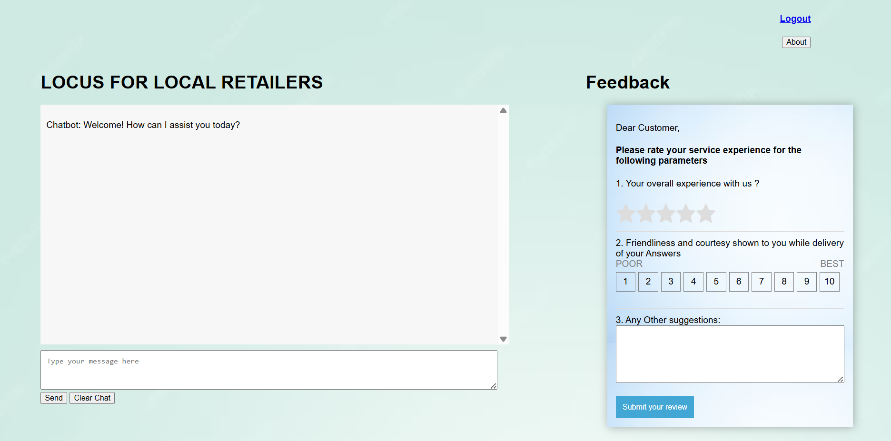

# 🛍️ Locus — AI-Powered Local Retail Recommendation Chatbot

An intelligent chatbot that recommends nearby local shops to users based on their queries. Built with Python, Flask, and a trained ML model, Locus helps users discover local retailers through a conversational interface.


---

## 📸 Screenshot



---

## 📊 Overview

Locus bridges the gap between local retailers and customers. Users chat with the bot, describe what they're looking for, and get instant recommendations for nearby shops — all powered by a trained machine learning model.

---

## ✨ Features

- 🤖 **Conversational interface** — natural language chatbot for shop discovery
- 🏪 **Smart recommendations** — ML model matches user queries to relevant local shops
- ⭐ **Feedback system** — users can rate their experience and submit reviews
- 📍 **Local retail focus** — dataset of real local shop data
- ⚡ **Fast responses** — pre-trained model (`model.pkl`) for instant inference
- 🌐 **Web interface** — clean HTML frontend served via Flask

---

## 🏗️ Architecture

```
User Query (natural language)
        │
        ▼
  Text Vectorizer        (vectorizer.pkl — TF-IDF / CountVectorizer)
        │
        ▼
  ML Classification Model  (model.pkl — trained on shop dataset)
        │
        ▼
  Shop Recommendation      (matched from DATA_FINAL_SHOPS.xlsx)
        │
        ▼
  Flask API  ──────────────▶  HTML Chatbot Interface
```

---

## 🗂️ Project Structure

```
LOCUS-FOR-LOCAL-RETAILERS/
├── templates/
│   ├── home.html              # Landing page
│   └── newcbotline.html       # Chatbot interface
├── newch.py                   # Flask app & recommendation logic
├── model.pkl                  # Trained ML classification model
├── vectorizer.pkl             # Fitted text vectorizer
├── DATA_FINAL_SHOPS.xlsx      # Local retailer dataset
├── Request Response 50.xlsx   # Test queries & responses
├── screenshot.png             # App screenshot
└── README.md
```

---

## 🚀 Quick Start

### 1. Clone the repository
```bash
git clone https://github.com/Gangula-Varshitha/locus-for-local-retailers.git
cd locus-for-local-retailers
```

### 2. Install dependencies
```bash
pip install flask scikit-learn pandas openpyxl
```

### 3. Run the app
```bash
python newch.py
```

### 4. Open in browser
Visit `http://localhost:5000` to start chatting with the bot!

---

## 💬 Example Interaction

```
User: I'm looking for a grocery store nearby
Bot:  Here are some local shops that match your query:
      🏪 Fresh Mart — 0.3 miles away
      🏪 Green Grocers — 0.7 miles away
      🏪 Daily Needs Store — 1.1 miles away
```

---

## 🧠 ML Model Details

| Component     | Details                           |
|---------------|-----------------------------------|
| Vectorizer    | TF-IDF / CountVectorizer          |
| Model         | Trained classifier (scikit-learn) |
| Training data | Local retailer dataset            |
| Input         | Natural language user query       |
| Output        | Matched shop recommendations      |

---

## 🛠️ Tech Stack

| Layer      | Technology           |
|------------|----------------------|
| Backend    | Python, Flask        |
| ML Model   | scikit-learn         |
| Data       | pandas, openpyxl     |
| Frontend   | HTML, CSS            |
| Dataset    | Excel (XLSX)         |

---

## 📄 License

MIT License — see [LICENSE](LICENSE) for details.

---

*Built by [Varshitha Reddy Gangula](https://www.linkedin.com/in/varshithagangula080602/)*